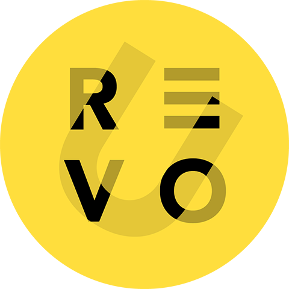
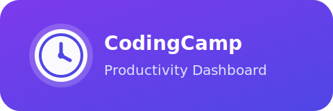
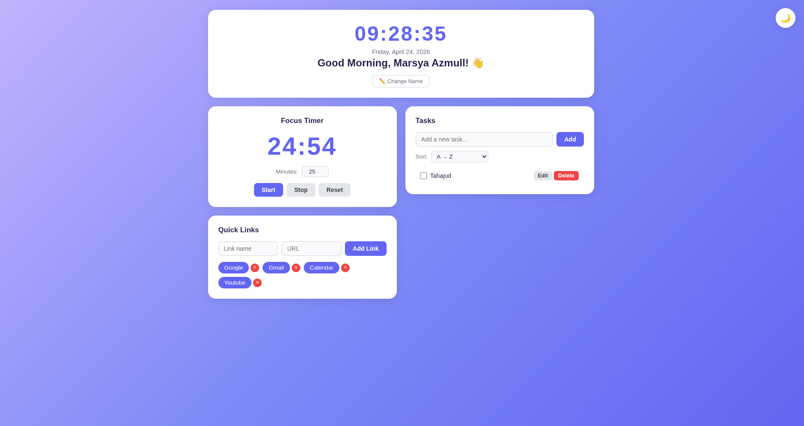
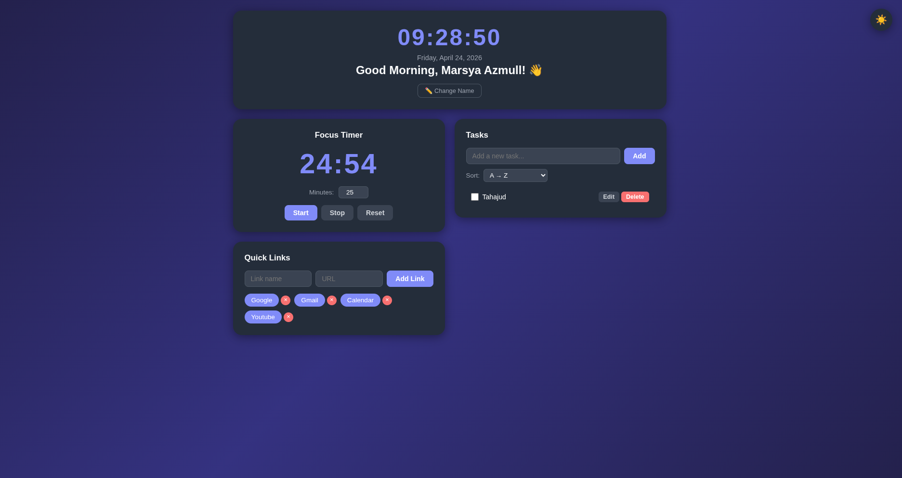

<p align="center">
  
  &nbsp;&nbsp;
  
</p>

<p align="center">
  
  
  
  
  
</p>

A clean personal productivity dashboard built with plain HTML, CSS, and vanilla JavaScript. It combines a live greeting, focus timer, task manager, and quick links in one lightweight client-side app.

## 🔎 Project overview

CodingCamp is a browser-based dashboard for daily productivity. It is designed to be simple, fast, and fully client-side, with data saved in Local Storage so your theme, tasks, name, timer settings, and quick links stay available after refresh.

## 📸 Showcase

<p align="center">
  
</p>

<p align="center">
  
</p>

## ⭐ Main features

- Live clock, date, and time-based greeting
- Light / dark mode toggle
- Custom name greeting with modal editing
- 25-minute focus timer with start, stop, reset, and custom minutes
- To-do list with add, edit, complete, delete, and duplicate prevention
- Task sorting options: default, A → Z, Z → A, active first, completed first
- Quick links panel with add and remove actions
- Local Storage persistence for all user data

## 🧱 Tech stack

- HTML
- CSS
- Vanilla JavaScript
- Browser Local Storage API
- GitHub Pages-compatible static structure

## 📁 Detailed repository structure

```txt
CodingCamp-24Apr26-AliefAthallahPutra/
├── assets/
│   ├── codingcamp-logo.svg       # README logo
│   ├── dashboard-light.png       # README showcase image
│   └── dashboard-dark.png        # README showcase image
├── css/
│   └── style.css                 # All styling in one file
├── js/
│   └── app.js                    # All application logic in one file
├── screenshots/                  # Original screenshot sources
├── others/
│   └── INSTRUCTIONS.md           # Project requirements and notes
├── index.html                    # Main page structure
└── README.md                     # Project documentation
```

## 🧑‍💻 Requirements

- A modern browser such as Chrome, Firefox, Edge, or Safari
- No build step required
- No backend required
- No framework required
- Optional: VS Code Live Server for local preview

## ⚙️ Local setup

1. Get the repository using one of the methods below.
2. Open the project folder.
3. Run it directly by opening `index.html` in your browser, or use a local server such as Live Server.
4. Interact with the dashboard and refresh the page to confirm Local Storage persistence.

### Quick local preview

```bash
# If you have Python installed
python3 -m http.server 8000
```

Then open:

```text
http://localhost:8000
```

## 🌍 How to get the repository

### Recommended: git clone

```bash
git clone https://github.com/Alief1150/CodingCamp-24Apr26-AliefAthallahPutra.git
cd CodingCamp-24Apr26-AliefAthallahPutra
```

### Download with curl

```bash
curl -L -o repo.zip https://github.com/Alief1150/CodingCamp-24Apr26-AliefAthallahPutra/archive/refs/heads/main.zip
unzip repo.zip
cd CodingCamp-24Apr26-AliefAthallahPutra-main
```

### Download with wget

```bash
wget -O repo.zip https://github.com/Alief1150/CodingCamp-24Apr26-AliefAthallahPutra/archive/refs/heads/main.zip
unzip repo.zip
cd CodingCamp-24Apr26-AliefAthallahPutra-main
```

## 🪟 Windows setup

Use PowerShell, Windows Terminal, or Git Bash.

1. Clone or download the repo.
2. Open the project folder.
3. Launch `index.html` directly, or use Live Server in VS Code.
4. If you prefer a local server, run:

```powershell
python -m http.server 8000
```

5. Open `http://localhost:8000` in your browser.

## 🐧 Linux setup

Works on Ubuntu, Debian, Arch, Fedora, Mint, and other Linux distributions.

1. Clone or download the repo.
2. Open the project folder.
3. Start a simple local server if needed:

```bash
python3 -m http.server 8000
```

4. Open `http://localhost:8000` in your browser.
5. Or open `index.html` directly in a browser for a quick offline preview.

## 🔐 Environment variables

No environment variables are required for this project.

Important:

- All data is stored client-side in the browser
- Do not commit browser storage data or secrets
- The app does not depend on any `.env` file

## 📦 Notes / limitations

- The app is fully static and runs without a backend
- Data persistence depends on the browser’s Local Storage
- Clearing site data will reset tasks, quick links, timer settings, theme, and saved name
- The project is ready for GitHub Pages hosting as a static site

## 📌 Credits

Created for Coding Camp mini project work by Alief Athallah Putra.
