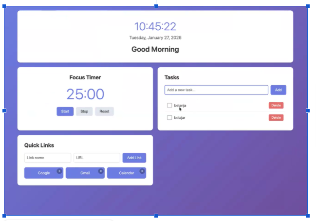

**Technical Constraints**

### **TC-1: Technology Stack**

- HTML for structure
- CSS for styling
- Vanilla JavaScript (no frameworks like React, Vue, etc.)
- No backend server required

### **TC-2: Data Storage**

- Use browser Local Storage API
- All data stored client-side only

### **TC-3: Browser Compatibility**

- Must work in modern browsers (Chrome, Firefox, Edge, Safari)
- Can be used as standalone web app or browser extension

## **Non-Functional Requirements**

### **NFR-1: Simplicity**

- Clean, minimal interface
- Easy to understand and use
- No complex setup required
- No test setup required

### **NFR-2: Performance**

- Fast load time
- Responsive UI interactions
- No noticeable lag when updating data

### **NFR-3: Visual Design**

- User-friendly aesthetic
- Clear visual hierarchy
- Readable typography

##

##

## **Required Features (MVP)**

Your project **must include**:

### **Greeting**

- - Show current time and date
    - Show a greeting based on the time of day
- **Focus Timer**
  - 25-minute timer
  - Start, stop, and reset buttons

### **To-Do List**

- - Add tasks
    - Edit tasks
    - Mark tasks as done
    - Delete tasks
    - Save tasks using Local Storage

### **Quick Links**

- - Buttons that open favorite websites
    - Links must be saved in Local Storage

##

## **Folder Rules**

- Only **1 CSS file** inside css/
- Only **1 JavaScript file** inside js/
- Keep code clean and readable

##

## **GitHub & Deployment** (_Only basic Git is needed_)

- Use GitHub Desktop to save your work
- Push your code to GitHub
- Publish the site using GitHub Pages

##

## **‼️Challenges** _(Choose 3)_

**Choose 3** out of these 5 options to make your project more interactive and user-friendly:

- ~~Light / Dark mode~~
- ~~Custom name in greeting~~
- Change Pomodoro time
- Prevent duplicate tasks
- ~~Sort tasks~~

##

## **Submission**

- After finishing your website, upload the Source Code to **your** **GitHub Repository** and publish the website in [Github Pages](https://pages.github.com/). Make sure to **include .kiro folder in your source code on GitHub**.
- Submit your **AWS Builder ID, GitHub Repo URL, and published website** through a dedicated [Paperform submission](https://rebrand.ly/FCSWE-miniproject) that will be opened on **Wednesday.**

**_Important:_** _If you do not submit_ **_all required links_** _on Paperform, your submission will_ **_not be valid_**_._

**Example of expected Output:**

